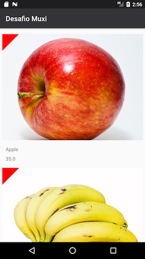

# TITULO

## Descrição Geral

Desafio tecnico da empresa MuxiDev.




## Descrição técnica

### Resumo
Na solução para este app, propus a utilização de RxJava, em conjunto com a proposta do Android Architecture Components (AAC), recomendada pelo Google.

Ambas utilizam o conceito de "reativo". Porém AAC faz uso da vantagem de livrar o desenvolvedor das preocupações do ciclo de vida da aplicação em Android. Conseqüentemente, para lógica entre View e Model, utilizei AAC.

Para a lógica de chamadas do repositório ao componente HTTP e ao componente de código nativo, utilizei RxJava + RxAndroid.

Para a implementação do componente de código nativo em C, utilizei o exemplo descrito em: https://github.com/googlesamples/android-ndk/tree/master/hello-jni
Apesar de ser possível utilizar assincronicidade da arquitetura em C, com callbacks, como demonstrado em outros samples, optei por usar o paradigma do Rx em RxJava, que é mais robusto e documentado na comunidade de desenvolvimento.

Para cacheamento da API, utilizei o Hawk, abstraído por um DAO simples.

Para cacheamento de imagem, utilizei o default do Picasso.


### Principais bibliotecas JAVA:
- `android.arch.lifecycle`: Usei componentes como Mutable Live Data e ViewModel que ajudam a representar o Model e a unir esta à view, mantendo o estado dos componentes ao longo do ciclo de vida da activity ou fragment. Também utilizamos o recurso de ouvir à mudanças no Model de modo que podemos refletir as mudanças na View correspondente. Link: https://developer.android.com/topic/libraries/architecture/ 

- `com.squareup.retrofit2`: Biblioteca para interfacemento com APIs Web sob protocolo HTTP. Link: http://square.github.io/retrofit/ 

- `o.reactivex.rxjava2`: Bilioteca que permite realizar uma programação assíncrona em Java. Link: https://github.com/ReactiveX/RxJava  

- `com.orhanobut:hawk`:  Biblioteca para cacheamento de API.

## Itens não implementados

- Testes unitários;
- Testes funcionais (embora eu tenha experiência comprovada na área com Calabash e Appium).
- Build do apk utilizando o Android.mk (Android)
- Material Design (não foquei nos espaçamentos estabelecidos para margens, padding, etc)

## Testes

Os testes utilizam o buildtype ```instrumentation``` para rodar, pois forçamos que o app seja buildado para apontar para localhost durante os testes.
Adicionamos duas classes de testes com um método simples para cada.

Para iniciar os testes:
-  Conecte um device ou abra um emulador;
-  No terminal, no diretório do projeto, execute: `chmod 777 ./gradlew`
-  Execute o comando no terminarl: `./gradlew connectedAndroidTest`